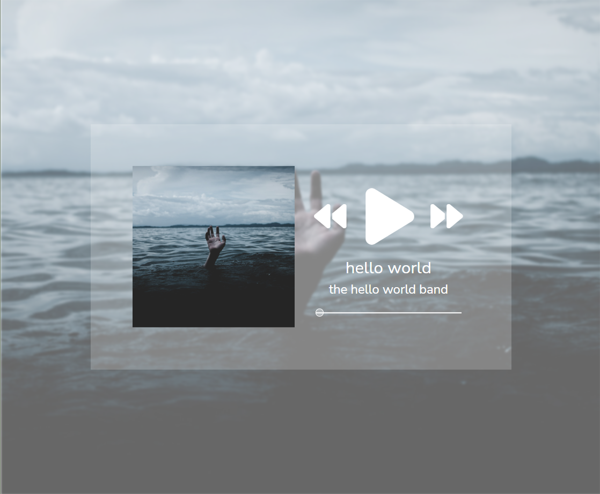
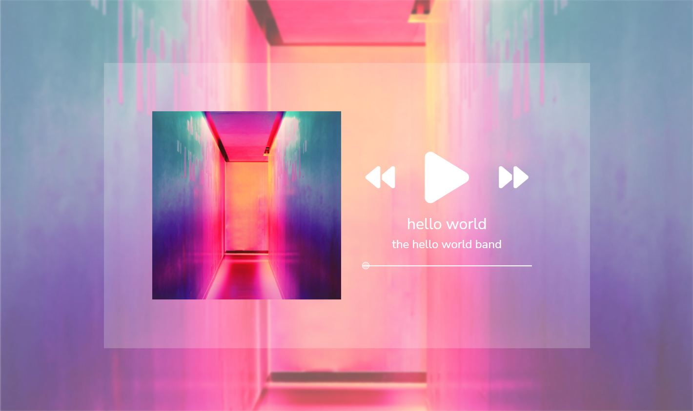
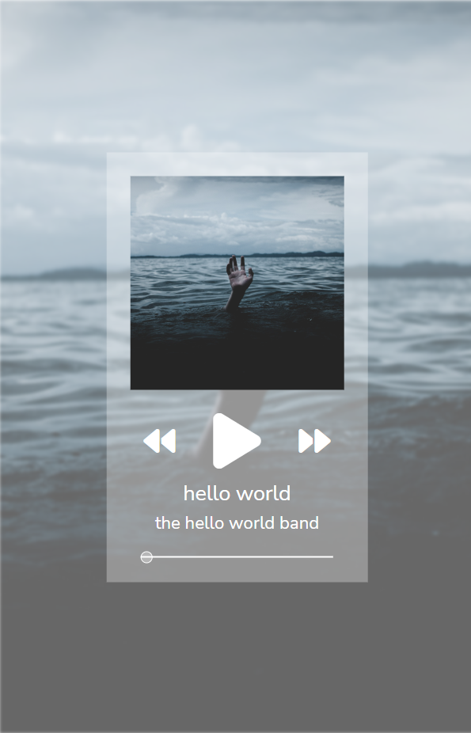
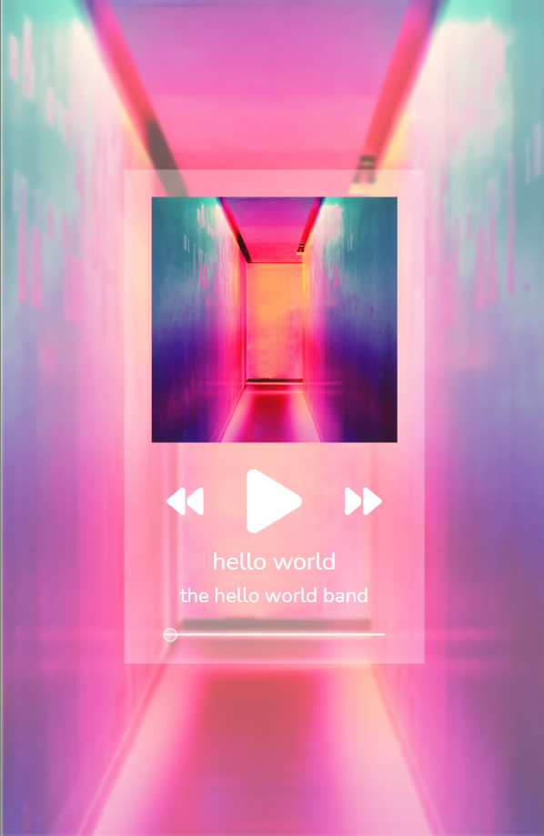

<h1 align="center">Daily UI Day 008: Media Player</h1>

<p align="center">
This is a media player for Daily UI's Day 008 challenge for the <a href="https://www.dailyui.co/"> 100 Days of UI 
challange.</a></p>

- [Repo](https://github.com/kelseychristensen/Daily-UI-Day-008 "Daily UI Day 03 Repo")
- [Dribbble](https://dribbble.com/shots/20035611-Daily-UI-Day-008-Media-Player "Dribbble Link")






## My Process

### Made with

- HTML
- CSS
- Bootstrap

### What went into this project

I decided to make a music player for this challenge, and put a little extra time into making sure it would look good in a variety of contexts: on a phone, on a computer, on an infotainment screen for a car. 

I created the interface with a lot of help from Bootstraps columns, which help with the responsiveness, and tweaking as needed for different media widths. 

I also demo'd this with two different "albums". 

### What I learned 

All about the range input and a little bit on how to style them

### Continued Development

Coding it up with javascript or python to make it functional! Especially: pulling in the album art for whatever is playing, making the seek seek to a point in the song, and making the buttons functional.

### Resources 

[This](https://www.w3schools.com/tags/att_input_type_range.asp#:~:text=Definition%20and%20Usage,accepted%20with%20the%20attributes%20below.), [this](https://www.cssportal.com/style-input-range/), and [this](https://www.geeksforgeeks.org/create-a-music-player-using-javascript/) were instrumental. 

Album art by [Stormseeker](https://unsplash.com/@sseeker) and [Efe Kurnaz](https://unsplash.com/@efekurnaz) on [unsplash.](https://unsplash.com/)

```html
        <!--Album art-->
        <div id="album-art" class="col-lg-6 col-sm-12">
            
        </div>
        <!--Details and Player-->
        <div class="col-lg-6 col-sm-12">
            <div class="play-controls">
                <div class="row">
                    <div id="fwd" class="col-4"> <i  class="fa-solid fa-backward fa-2xs"></i></div>
                    <div id= "play" class="col-4"> <i class="fa-solid fa-play fa-lg"></i></div>
                    <div id= "bwd" class="col-4"> <i  class="fa-solid fa-forward fa-2xs"></i></div>
                </div>
            </div>
            <div class="song-title">
                <h2>hello world</h2>
            </div>
            <div class="artist-name">
                <h4>the hello world band</h4>
            </div>
            <div class="slider_container">
                <input type="range" min="1" max="100"
                value="0" class="slider">
            </div>
        </div>

```

```css
/*RESPONSIVENESS*/

@media only screen and (max-width: 800px) {
  .container {
    font-size: 4rem;
    width: 55%;
    padding: 5%;
  }
  .album_avatar {
    width: 100%;
    padding-bottom: 20px;
  }
  .container {
    background: rgb(255, 255, 255, .3);
  }
}
```

Kelsey Christensen

- [Profile](https://github.com/kelseychristensen "Kelsey Christensen")
- [Email](mailto:kelsey.c.christensen@gmail.com?subject=Hi "Hi!")
- [Dribble](https://dribbble.com/kelseychristensen "Hi!")
- [Website](http://kelseychristensen.com/ "Welcome")
